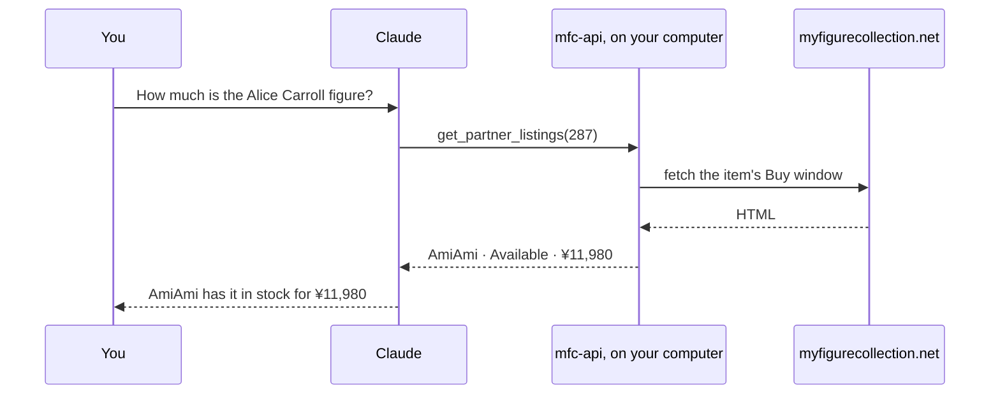
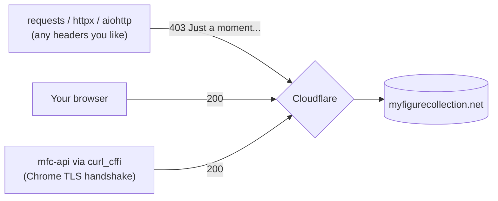

# myfigurecollection-api

<!-- sarakay.me/downloads -->
**Install:** `pip install myfigurecollection-api` · [all formats & checksums](https://sarakay.me/downloads.html#myfigurecollection-api)

An unofficial [MyFigureCollection.net](https://myfigurecollection.net) API: a Python
library plus a local **MCP server**, so agents can read figure data, collections,
lists and clubs.

MFC has no working public API. Its own API club ([#349](https://myfigurecollection.net/club/349))
has been promising "API v4 coming soon" for eight years. This package reads the
public HTML instead, and turns it into typed models.

## New here? The short version

MyFigureCollection is the largest catalog of anime figures and merch on the
internet, and for years there has been no good way for a program to read it.
This project fixes that on your own computer. You install it once, and an AI
assistant like Claude can then look things up on MFC for you: "how much is this
figure at AmiAmi?" or "list every Chiikawa item releasing in October."



**What is MCP?** The Model Context Protocol is a standard plug for giving AI
assistants new abilities. An MCP server is a small program on your machine that
an assistant is allowed to call. This one gives your assistant 12 MFC abilities,
from item search to barcode lookup. Adding it takes one snippet in a config
file, shown in [Use it as an MCP server](#use-it-as-an-mcp-server).

**Why not use MFC's official API?** There isn't one. The site's own API club
has been waiting for it since 2018.

**Why isn't this a website I can visit?** Cloudflare guards MFC and decides who
gets in partly by IP reputation. It trusts connections from home computers and
distrusts servers, so a hosted version would get blocked within days while a
copy on your own machine keeps working. That constraint shaped the whole
design.

**Do I need to know Python?** Two terminal commands to install (below). After
that your assistant does the driving.

## Why this exists (and why the obvious approach fails)

MFC is behind Cloudflare, which blocks on **TLS fingerprint** — not user-agent.
`requests`, `httpx` and `aiohttp` all get a 403 "Just a moment..." challenge no
matter what headers you send. That is why the older `tenji` scraper stopped
working; its parsers never even received HTML.

This package uses [`curl_cffi`](https://github.com/lexiforest/curl_cffi) with
`impersonate="chrome"`, which reproduces a real Chrome handshake and gets a 200.
**That choice is load-bearing.** Swapping in a normal HTTP client will break
everything.

It is also why this ships as a *local* tool rather than a hosted service:
Cloudflare weights IP reputation, so a scraper on datacenter IPs gets challenged
and burns the shared address for everyone. Run it on your own machine.



## Install

This needs **Python 3.10+**. The package is on PyPI:

```bash
pip install myfigurecollection-api
```

On a Mac, `python3` is often Xcode's 3.9, which will not run this code, so be
explicit about the interpreter (e.g. `pip3.12`). Working from a clone instead,
use `pip3.12 install -e .`.

Then check it landed:

```bash
mfc-api item 287
```

If `mfc-api` isn't found, your shell's `python3` bin directory isn't on `PATH`. Find the
script with `python3.12 -c "import sysconfig; print(sysconfig.get_path('scripts'))"` and
use that absolute path.

## Use it as an MCP server

`mfc-api` with no arguments starts the MCP server on stdio. Add this to your MCP config —
`~/Library/Application Support/Claude/claude_desktop_config.json` for Claude Desktop, or
`.mcp.json` in your project for Claude Code:

```json
{
  "mcpServers": {
    "myfigurecollection": {
      "command": "uvx",
      "args": ["myfigurecollection-api"]
    }
  }
}
```

This needs [`uv`](https://docs.astral.sh/uv/) installed; `uvx` fetches the package
from PyPI on first run, so there is nothing else to set up.

No `uv`? Point `command` at the installed script by its **absolute path**, e.g.
`/Library/Frameworks/Python.framework/Versions/3.12/bin/mfc-api`. The path must be
absolute because MCP clients launch servers with a minimal `PATH` that does not
include your shell's Python bin directory — a bare `"command": "mfc-api"` will fail
even though it works in your terminal.

### Tools

| Tool | What it returns |
|---|---|
| `get_item(item_id)` | Full item: category, picture, origins, characters, companies, artists, releases (date / edition / price / barcode), scale, height, rating, owner counts |
| `search_items(query, page, category_id)` | 50 items per page, with pagination |
| `search_by_barcode(barcode)` | Item lookup by JAN/UPC — the join key for matching an item across stores |
| `get_partner_listings(item_id)` | Which partner shops sell an item, with availability and price |
| `get_shop(shop_id)` | Homepage, location, shipping, rating, review and item counts |
| `search_shops(keywords, page, average_score, partners_only)` | The shop directory, 10 per page |
| `get_profile(username)` | Join date, hits, rank, about fields, per-category collection counts |
| `get_collection(username, status, page)` | 50 items per page; `status` is `owned`, `ordered`, `wished` or `favorites` |
| `get_user_lists(username, page)` | A user's published item lists |
| `get_list(list_id, page)` | A list's owner, description, tags and items |
| `get_club(club_id)` | Description, threads, recent comments, staff, members |
| `get_club_members(club_id, page)` | The full member roster |

`get_club` is new — `tenji` never had it.

### Two things to know about store data

**Prices only exist where MFC has a barcode.** `get_partner_listings` returns every
partner shop, but MFC can only check real stock for items whose JAN it recorded. For an
item with no barcode, all 32 partners come back as `maybe_available` with no price.
**That means "not checked", not "in stock".** Filter on `availability == "available"`.

**`search_by_barcode` is a lookup, not a search.** A known barcode returns the full item
under `item` with `matched: true`. An unknown one returns `matched: false` — which
includes barcodes that are real but that MFC simply never recorded, common for Western
releases.

### Configuration

| Environment variable | Default | Meaning |
|---|---|---|
| `MFC_API_RATE_LIMIT` | `1.0` | Seconds between requests |
| `MFC_API_CACHE_TTL` | `3600` | Cache lifetime in seconds; `0` disables |
| `MFC_API_CACHE_DIR` | `~/.cache/mfc-api` | Where cached pages live |
| `MFC_API_LOG_LEVEL` | `WARNING` | Server log level (logs go to stderr) |

## Use it as a library

```python
from mfc_api import MFCClient, CollectionStatus

with MFCClient() as mfc:
    item = mfc.get_item(287)
    print(item.name)                       # Aria - Alice Carroll - Maa - 1/6 (Toy's Works)
    print(item.releases[0].price)          # 6980.0
    print([c.name for c in item.characters])  # ['Alice Carroll', 'Maa']

    collection = mfc.get_collection("Climbatize", status=CollectionStatus.OWNED)
    print(collection.stats.owned, collection.pagination.total_pages)

    # Walk every page, politely (one request per second)
    for page in mfc.iter_collection("Climbatize", max_pages=3):
        print(page.pagination.current_page, len(page.items))
```

Everything under one origin or character (library and CLI only — not an MCP tool):

```python
with MFCClient() as mfc:
    page = mfc.get_entry_items(237138)          # Chiikawa, oldest first, 50 per page
    print(page.pagination.total_items)          # 7247
    item = mfc.get_item(page.items[0].id)
    print(item.picture_large)                   # full-size upload/items/2/ picture
```

`Item.picture` is a 256px preview; `Item.picture_large` is the original upload.
`transport.get_bytes(url)` fetches a picture through the same rate limiter, and
a 429 raises `MFCRateLimitedError` carrying `retry_after` instead of being retried.

Barcode in, prices out:

```python
from mfc_api import MFCClient

with MFCClient() as mfc:
    match = mfc.search_by_barcode("4543341130624")
    if match.matched:
        for listing in mfc.get_partner_listings(match.item.id).available:
            print(listing.shop_name, listing.price, listing.currency)  # AmiAmi 11980.0 JPY
```

## Use it from the shell

```bash
mfc-api item 287
```

```bash
mfc-api barcode 4543341130624
```

```bash
mfc-api listings 287
```

```bash
mfc-api shops Japan --partners
```

```bash
mfc-api collection Climbatize --status owned --page 2
```

Everything prints JSON on stdout; logs go to stderr. `mfc-api --help` lists every
subcommand. `mfc-api-cli` is kept as an alias.

## Archiving an item page to the Wayback Machine

A price or a listing you read today is uncitable tomorrow: the page will have
moved on, and nobody has to take your word for what it said. `archive=True`
files the **public item page** with the Internet Archive's Save Page Now and
attaches the result to the item.

```python
with MFCClient() as mfc:
    item = mfc.get_item(287, archive=True)
    print(item.releases[0].price, item.archive.wayback_url)
    # 6980.0 https://web.archive.org/web/20260903081500/https://myfigurecollection.net/item/287
```

Three things fall out of one hook: a price-history series accumulates as a
byproduct of ordinary reads, every row becomes auditable by someone who does not
trust you, and the data survives the site. That last one is not hypothetical —
`tenji` died, and Mandarake went dark in September 2026.

**It never breaks a read.** A failure is a row, not an exception:
`item.archive.status` is one of `success`, `already` (a recent capture existed,
so the Archive declined to make another — still a preservation success),
`skipped`, `pending`, or `failed` with a `reason`. If the Internet Archive is
down you still get the item.

### Nothing about a person is ever archived

Most of MFC is people. `is_public_item_url` is a **whitelist** of `/item/<id>`
with no query string, so profiles, collections, user lists and club rosters are
refused before any request is made:

```python
mfc.snapshot("https://myfigurecollection.net/item/287")       # captured
mfc.snapshot("https://myfigurecollection.net/profile/someone")  # skipped, never sent
```

A whitelist rather than a blacklist on purpose: a new personal URL shape cannot
leak through something that only lists what to keep.

### It is opt-in for a reason

Reads default to `archive=False`, and archiving is meant to run as its own
deliberate pass over the items you actually care about — not inline in a
latency-sensitive loop:

- **Weekly cadence.** A JSON ledger records when each URL was last captured;
  anything captured in the last 7 days is skipped without a request. Weekly is
  plenty of resolution for a price curve and much gentler on both the Archive
  and MFC. The submit also carries `if_not_archived_within=7d`, so the Archive
  enforces the same window even if the ledger is lost.
- **Serialized, one every 6 seconds**, with a per-run cap of 50, and
  `Retry-After` honoured on a 429.

| Setting | What it does |
|---|---|
| `MERCH_ARCHIVE=0` | Kill switch — disables every snapshot in the process. Shared with the sibling merch clients, so one variable turns archiving off across a bulk run. |
| `MERCH_ARCHIVE_LEDGER` | Ledger path, shared across sibling clients so one pass keeps one honest cadence per URL. |
| `MFC_ARCHIVE_LEDGER` | Ledger path for this package only. Default: `<cache dir>/archive-ledger.json`. |
| `IA_ACCESS_KEY` / `IA_SECRET_KEY` | Internet Archive S3 keys. Free, from [archive.org/account/s3.php](https://archive.org/account/s3.php). On macOS they are also read from the Keychain services `ia-s3-access` / `ia-s3-secret`. |

Without credentials the result is `status="failed"` with a reason naming the
fix — not a crash, and not a silent no-op.

Build one `Archiver` per pass and reuse it (the client does this for you), so
the rate limiter and the per-run cap apply across the whole batch rather than
resetting each time.

## Being a good citizen

- Rate-limited to **1 request/second** by default, process-wide.
- Responses are cached on disk for an hour, so repeated agent calls cost nothing.
- Read-only. There are no login, write, or vote operations, and none are planned.
- Wayback snapshots are opt-in, weekly per URL, capped per run, and restricted
  to `/item/<id>` pages — never a profile, collection, list or club page.

If you scrape MFC hard enough to be noticed, Cloudflare will start challenging
your IP, and you will have made the site worse for everyone. Don't.

## Tests

```bash
python3 -m pytest
```

The default run is entirely offline — parser tests read saved HTML fixtures
captured on 2026-07-30. Tests that hit the live site are marked `live` and
deselected by default:

```bash
python3 -m pytest -m live
```

Run those when MFC's markup may have changed; they are the canary.

## Credits

The parser architecture — a parser class per page, given HTML, returning a
model — is ported from [`tenji`](https://pypi.org/project/tenji/) by
**Nate Shoffner** (MIT). The selectors are not: MFC's templates moved on since
tenji's last release. Two endpoints tenji used are gone entirely
(`itemlists.v4.php` now 404s), and the collection, profile, list and shop pages
all render different markup than it expects.

One piece of tenji did survive verbatim: the Buy window is still a form POST to
`/item/{id}` with `commit=loadWindow&window=buyItem`, answering with JSON. That
envelope is tenji's discovery and it still works in 2026.

tenji's MIT notice is reproduced in full in [NOTICE](NOTICE), along with a
precise account of what was and wasn't derived from it.

## Disclaimer

Unofficial. Not affiliated with, endorsed by, or supported by
MyFigureCollection.net or Tsuki Board. It scrapes public pages and will break
whenever MFC changes its HTML. Item data belongs to MFC and its contributors.

MIT licensed — see [LICENSE](LICENSE).

Built by [Sara Kay](https://sarakay.me).

mcp-name: io.github.ssskay/myfigurecollection-api
